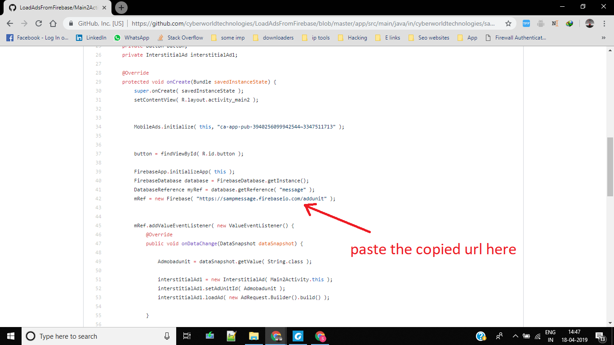

# LoadAdsFromFirebase

1.IMPORT [LoadAdsFromFirebase.json](https://github.com/cyberworldtechnologies/LoadAdsFromFirebase/blob/master/LoadAdsFromFirebase.json) file in your firebase project.

2.Now follow the method in the following screenshots:

    
